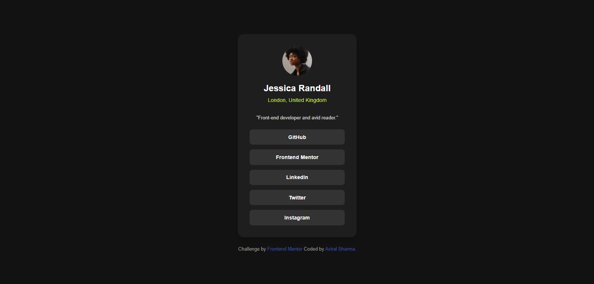

# Frontend Mentor - Social Links Profile Solution

This is a solution to the [Social Links Profile Challenge on Frontend Mentor](https://www.frontendmentor.io/challenges/social-links-profile-UG32l9m6dQ). Frontend Mentor challenges help you improve your coding skills by building realistic projects.

## Table of Contents

- [Overview](#overview)
  - [The Challenge](#the-challenge)
  - [Screenshot](#screenshot)
  - [Links](#links)
- [My Process](#my-process)
  - [Built With](#built-with)
  - [What I Learned](#what-i-learned)
  - [Continued Development](#continued-development)
  - [Useful Resources](#useful-resources)
- [Author](#author)
- [Acknowledgments](#acknowledgments)

## Overview

### The Challenge

Users should be able to:

- See hover and focus states for all interactive elements on the page.

### Screenshot

### Links

- **Solution URL**: [Add solution URL here](https://github.com/avirals14/social-links-profile)
- **Live Site URL**: [Add live site URL here](https://avirals14.github.io/social-links-profile/)

## My Process

### Built With

- **Semantic HTML5** markup
- **CSS** for styling
- Flexbox and Grid for layout
- Responsive design principles

### What I Learned

During this project, I gained a better understanding of:

1. **Responsive Design:**  
   - How to create div tags that adapt to different screen sizes.
   - Styling elements using CSS media queries for responsiveness.

2. **Hover & Focus States:**  
   - Implementing hover and focus effects to improve interactivity.

3. **Version Control with Git:**  
   - Using basic Git commands such as `git add`, `git commit`, and `git push` to manage and deploy the project efficiently.

### Continued Development

In the future, I plan to:

- Work on more advanced styling techniques to improve aesthetics.
- Optimize my CSS code for better performance and scalability.
- Explore JavaScript to add dynamic interactivity to similar projects.

### Useful Resources

- **ChatGPT**: It helped me resolve issues and clarify doubts during the development process.

---

## Author

- **Name:** [Aviral Sharma](#)
- **Frontend Mentor Profile:** [@avirals14](https://www.frontendmentor.io/profile/avirals14)
- **GitHub:** [Aviral Sharma](https://github.com/avirals14)
- **Twitter:** [@aviral2k5](https://www.twitter.com/aviral2k5)

---

Feel free to reach out for feedback or collaboration opportunities!